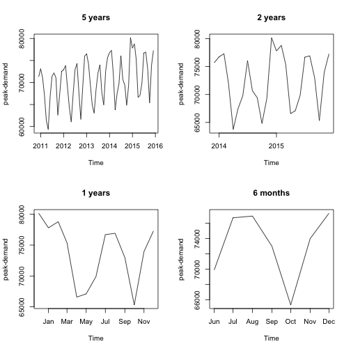
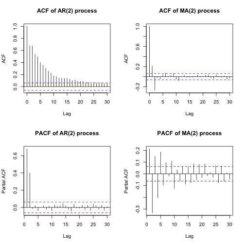
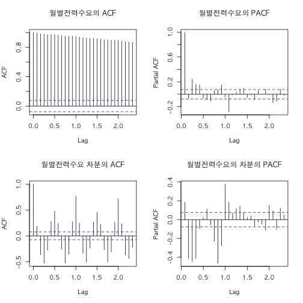
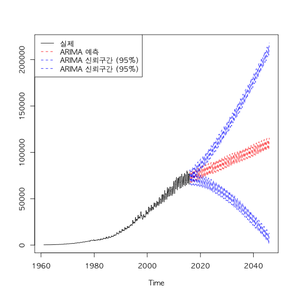

전력수요예측은 전력가격예측에서 필수적인 요소이다. 다른 변수(발전소 건설계획, 유가)에 비해서는 상당히 안정적인 시계열을 가지고 있기 때문에, 비교적 쉽게 분석할 수 있다. 본글에서는 전력 젼력거래소 [EPSIS](http://epsis.kpx.or.kr/epsis/)의 전력수급현황에서 공개되는 1960년~2016년 월별 데이터를 토대로 분석을 해볼 것이다.  

우선 전체적인 그림을 파악하기 위해서 최근 월간수요예측을 구간별로 나누어 보겠다. 아래의 그래프를 보면, 가장 눈에 띄는 것이 전력수요의 계절성(seasonality)이다. 여름/겨울에 많은 전기를 쓰고, 봄/가을에서는 상대적으로 적게쓴다. 3개월 주기에 따라서 Up&Down이 있다는 것을 알 수 있다.



## ARIMA 모형
본 글에서는 자기이동회귀평균(ARIMA,Autoregressive integrated moving average) 방법을 통해서 전력수요를 시계열 예측해볼 것이다. 과거의 데이터의 가중합(AR:자기회귀)과 과거의 예측의 오차의 가중합(MA,이동평균) 혼합해서 예측하는 기법이다. 자기회귀이동평균은 원칙적으로 안정적(stationary)인 데이터에만 쓰인다. 불안정하지만, 일정한 패턴이 있는 시계열의 경우 차분(differentiation:Integration)을 통해서 시계열 예측을 한다.  

ARIMA(p,d,q)(P,D,Q)N에서 (p,d,q)는 p는 자기회귀(AR)를 할 항의 개수, d는 차분계수(Integration), q는 이동평균(MA)의 개수를 의미한다. 또한 (P,D,Q)N는 계절성이 있는 ARIMA분석에서 쓰이는 계수이다. P는 계절AR계수, D는 계절차분, Q는 계절 이동평균을 의미한다. N은 계절계수를 의미한다. 월단위 자료인데, 1년단위로 계절성이 지속된다면, N=12 이다. ARIMA모델을 간단히 식으로 표현하면 아래와 같다.  

$$
ARIMA(p,d,q):  Y_t=C(상수)+Y_{t-1}* \phi_{t-1}+\\
...+Y_{t-p}* \phi_{t-p}+\epsilon_{t-1}* \theta_{t-1}+\\
....\epsilon_{t-q}* \theta_{t-q} \\
설명: \ C(상수):Y값의\ 평균  \,,\phi:AR계수 \ \\
 ,\theta:MA계수, \epsilon:오차(백색잡음)
$$

ARIMA모델은 후방연산자(backshift operator)를 가지고 표현될 수도 있다.후방연산자(B)는 현재의 값을 기준으로 과거의 값을 구할수 있는 연산자이다. ARIMA모형을 단순화시키고, 백색잡음과 각하의 관계를 명확하게 설정한다. 후방연산자는 아래의 식을 만족한다.

$$ 후방연산자\;기본모형:B^nY_t=Y_{t-n} \\$$

AR(p)의 경우 다음식으로 표현될 수 있다. 후방연산자를 통해서 백색잡음과 관계를 설정할 수 있다. 또한 $\Phi(B)$ 을 AR(p)의 특성함수라고 부른다.

$$Y_t=\Phi_1 Y_{t-1}+ \Phi_2 Y_{t-2}\; \dots+  \Phi_p Y_{t-p} + \epsilon_t \\
Y_t=\Phi_1BY_t+\Phi_2B^2Y_t+\; \dots+\Phi_pB^p Y_t + \epsilon_t\\
(1-\Phi_1B-\Phi_2B^2\dots-\Phi_pB^p))Y_t=\epsilon_t \\
\Phi(B)Y_t=\epsilon_t $$

MA(q) 모형의 후방연산자는  $\theta(B)$ 는 MA(q)의 특성함수라고 부른다.

$$Y_t=\epsilon_t-\theta_{1}\epsilon_{t-1}-\theta_{2}\epsilon_{t-2}-\dots \theta_{q}\epsilon_{t-q}\\
Y_t=\epsilon_t-\theta_{1}B\epsilon_t-\theta_{2}B^2\epsilon_t-\dots \theta_{q}B^q\epsilon_t\\
Y_t=\epsilon_t(1-\theta_{1}B-\theta_{2}B^2-\dots \theta_{q}B^q)\\
Y_t=\epsilon_t\theta(B)
\\$$

만약에서 차분한 시계열일 경우 후방연산자는 아래와 같이 된다.$$\bigtriangledown(B)$$는 차분항의 특성함수라고 부른다.

$$ 1회\; 차분:y_t=Y_t-Y_{t-1}=Y_{t}-BY_t=(1-B)Y_t \\
   2회\; 차분: z_t=y_t-y_{t-1} \\
   =(1-B)Y_t-(Y_{t-1}-Y_{t-2})\\
   =(1-B)Y_t-BY_t-B^2Y_t\\
   =(1-B)Y_t+B(1-B)Y_t\\
   =(1+B)(1-B)Y_t\\
   \vdots
   \\
   n회 차분:a_t= (1+B)^{n-1}(1-B)Y_t
$$

ARIMA모형은 자기회귀(AR),차분(diffentiation/Integration), 이동평균(MA)을 조합해서 최적의 예측을 찾는 것이다. 그렇다면 각 식의 후방연산자와 이를 통해서 들어난 특성함수를 통해서 ARIMA모형을 단순화 시킬수 있다. 비정상적인 시계열 $Y_1 \dots Y_t$를 n회 차분한 시계열을 $y_t$라고 하자. 그렇다면 해당 시계열은 아래와 같이 표현될 수 있다.

$$
y_t=\bigtriangledown^n Y_t\;(Y_t를\;n회\;차분한\;시계열)\\
y_t=\Phi_1 y_{t-1}+ \Phi_2 y_{t-2}\; \dots+  \Phi_p y_{t-p} + \\
\epsilon_t-\theta_{1}\epsilon_{t-1}-\theta_{2}\epsilon_{t-2}-\dots \theta_{q}\epsilon_{t-q}\\
\Phi(B)y_t=\epsilon_t\theta(B)\\
\bigtriangledown^nY_t=y_t=\frac{\theta(B)}{\Phi(B)} \epsilon_t\\
Y_t=\bigtriangledown(B)* \frac{\theta(B)}{\Phi(B)} \epsilon_t
$$


ARIMA모델에서 다음으로 고려해야 할 것은 "계절성(Seasonality)"이다. 계절성이란, 일정주기로 특정한 패턴을 보이는 시계열을 예측할때 쓰인다.ARIMA(p,d,q)는 계절내의 모형이 된다. 이와 별도로 계절간 모형을 파악해야 한다. 이때 중요한 것은 계절주기이다. 예를들어, 전력수요는 매월 비슷한주기의 패턴을 보인다. 이 경우 계절주기는 "12"이다. 이러한 같은 계절 끼리 차분한 모형을 "계절차분"라 한다. 아래의 식을 살펴보자.

$$
계절간\; 모형: z_1*z_{13}*\dots z_{1+12n}\\
  \Phi(B)*\bigtriangledown^{d}_{12}(B)=\epsilon_t*\theta(B)\\
$$

이때 쓰이는 함수가 자기상관함수(ACF,Auto-Correlation Function)와 편자기상관함수이다.ACF는 현재의 변수가 얼만큼 과거의 변수와 유의미한 상관관계를 갖는지 파악하는 함수이다. ACF가 시작인 k시점에서 t시점까지 모든 변수의 상관관계를 구한다면, PACF는 가장 최초시점인 t시점부터 끝시점인 k시점 중 중간변수의 상관관계를 제거한 변수를 의미한다.  

$$per
ACF:\rho(k)=Corr(Y_t,Y_{t-k})  \\
=\frac{\displaystyle\sum_{z=k+1}^{t}(Y_t-\bar{Y})(Y_{z-k}-\bar{Y}))}{\displaystyle\sum_{z=k+1}^{t}(Y_t-\bar{Y})}   \\
\\
PACF: Corr(Y_t,Y_{t-k}|Y_{t-1},\dots,Y_{t-k+1})\\
* 식은\;생략
$$

정상적인 시계열이라면 아래와 같은 특징을 지닌다.

1. AR모형일 경우 ACF는 처음 상관계수가 높다가 서서히 줄어든다. 자기상관계수니까 과거값 일수록 상관관계가 적어지는 것은 어찌보면 당연하다.

2. MA모형일 경우 ACF는 k시점 이후 완전히 감소한다. 이동평균은 k시점 이후는 고려하지 않기 때문이다.

3. AR모형일 경우 PACF는 k시점 이후 완전히 감소한다.

4. MA모형일 경우 PACF는 처음 상관계수가 높다가 서서히 줄어든다.



이러한 특징을 통해서 ARIMA계수의 p,d,q를 파악해볼수 있다.아래의 월별전력수요 ACF는 전혀 정상성을 만족하지 못한다. 1회 차분을 한 그래프를 보면 완벽하지 않지만, 정상성을 만족한다.


## ARIMA를 통한 월간전력수요 예측
이제 본격적으로 월간전력수요를 예측해보겠다. 전력수요는 월별 계절성이 있는 시계열이다.ARIMA(p,d,q)(P,D,Q)12의 모형이다. 여기서 계절내/계절간의 AR계수,MA계수, 차분계수를 파악하면 된다.

앞서 이야기한,ACF,PACF함수를 통해서 ARIMA계수를 예측할 수 있지만, R에서는 auto.arima함수를 통해서 최적의 계수를 자동으로 도출할 수 있다. 위 방법이 최선은 아니지만, 본글에서는 위방법을 토대로 진행하겠다.


```
## Series: ts.elec
## ARIMA(2,1,3)(0,1,2)[12]                    
##
## Coefficients:
##          ar1      ar2      ma1     ma2      ma3     sma1    sma2
##       0.8027  -0.8874  -1.3607  1.3350  -0.5887  -0.6935  0.1092
## s.e.  0.0582   0.0466   0.0499  0.0682   0.0519   0.0458  0.0462
##
## sigma^2 estimated as 933970:  log likelihood=-5364.84
## AIC=10745.67   AICc=10745.9   BIC=10781.45
```
auto.arima를 통해서 도출된 ARIMA모델은 "ARIMA(2,1,3)(0,1,2)[12]"이다. 위 모델을 가지고 향후 30년 전력수요 예측을 95%로 예측하면 아래와 같다.



## 마무리를 하며
본 예측은 지나치게 긴 기간을 표본(55년)으로 지나치게 긴 기간을 예측(30년)하려고 하여서 유의미한 결과를 도출했다고 보기 어렵다. 차후 예측에는 보다 적은 표본데이터로 적은 기간을 예측해보겠다.
