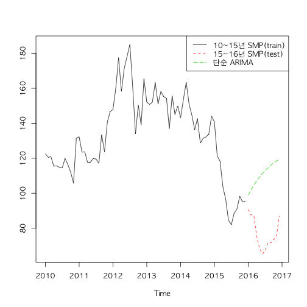
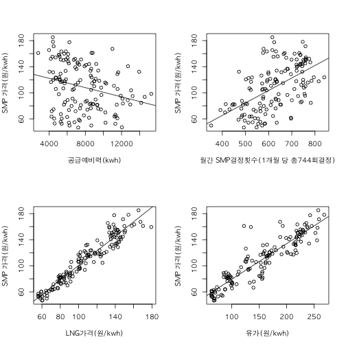
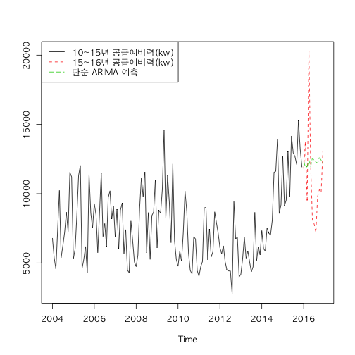
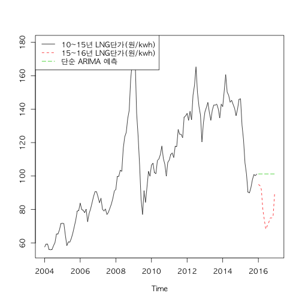
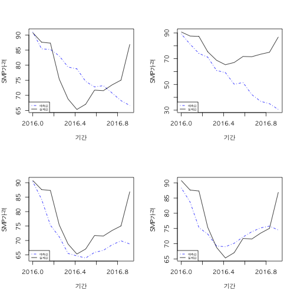

본 글에서는 VAR모형(Vector Autoregressive Model)을 통해서 계통한계가격(System Marginal Price)을 예측해 보겠다. 아래의 그림을 보면 알겠지만,전력수요와 달리 전력가격은 안정적이지 않다. 따라서 단순 ARIMA로 예측하기에는 한계가 있다. SMP가격은 끊임없이 변화하는 반면, ARIMA예측(1,0,0)은 고정적인 예측만 한다. 국제유가, 첨두전력의 비중과 같은 외부변수를 도입하여서 구조화된 모형으로 예측할 필요가 있다.

VAR모형은 자기회귀변수 뿐 만 아니라, 다양한 외부변수를 구조화하여서 예측할 수 있다. ARIMA모델이 과거값을 기반으로 예측하는 "자기회귀" 모형이라면,  VAR은 자기회귀 변수에 국제유가, 첨두전력의 비중을 도입해서 보다 복잡한 예측을 가능하게 한다. 본글은 [EPSIS](http://epsis.kpx.or.kr/epsis/)의 전력수급현황에서 공개되는 2004년~2015년 월별 데이터를 train set으로 할것이며, 2016년 데이터를 test set으로 할 것이다.


## 전력가격을 결정하는 변수

본글은 신동현,김재혁이 15년에 발표한 [전력 발전시장의 충격식별과 계통한계가격 변동성 분석]("https://www.kci.go.kr/kciportal/ci/sereArticleSearch/ciSereArtiView.kci?sereArticleSearchBean.artiId=ART002035364")를 참고하여서 전력가격을 분석하겠다. 위 논문에 따르면, 전력가격은 아래의 5가지 변수로 결정이 된다.

1. 전월 SMP 단가

2. 공급예비율: 발전소가 얼만큼 남았는지 나타내는 변수이다. 예비율이 낮으면, 가격이 높은 발전소까지 가동되며 SMP가 올라간다.

3. SMP 연료별 결정요인: 석유발전소에서 SMP가 결정되는지, LNG발전소에서 결정되는지? [첨두부하의 비중 추가설명](" https://www.facebook.com/youngji.cho1/posts/1065403453549672")

4. 연료원별 단가: LNG 및 유가

5. 예측오차: 전력거래소에서 전날 발전량을 예측하는데, 예측이 실패할수록 계통제약 정산금이 발생하여서 SMP 단가가 상승한다.

1~5번까지 변수들을 살펴보면, 공급예비력, 연료비중(LNG,유류)는 명백한 상관관계가 있지만, SMP 연료별 결정요인은 상관성이 떨어진다.본 글에서는 "SMP 연료별 결정요인","예측오차"를 제외할것이다.SMP 연료별 결정요인은 인과성이 떨어지고, 예측오차는 현재 자료를 확보할 수가 없다.



우선 3가지 변수를 고려한 SMP가격의  VAR모델은 아래와 같다. 여기서 $Y_t$는 단일변수가 아니라 벡터의 조합이다. 이전 SMP가격($y_{(1,t)}$), 공급예비력($y_{(2,t)}$), LNG가격($y_{(3,t)}$)으로 구성이 된다. A(L)은 후방연산자이며, $u_t$는 백색잡음인데, 이 또한 3X1인 벡터이다.

$$A_0Y_t=Z_t+A(L)Y_{t-1}+u_t$$

아까 살펴본 전월 SMP가격을 제외하고, 다른 변수인 공급예비력과 LNG단가를 살펴보자. 그래프에서도 나와있지만, 단순히 자기회귀분석을 했을 때, 공급예비력과 LNG단가의 예측은 빗나간다. 공급예비력은 발전소 건설계획과, 전력수요에 영향을 많이 받는다. 특히나 큰 오차를 보이는 LNG가격은 유가와 같은 다른 외생변수에 영향을 많아서 ARIMA예측은 사실상 무의미하다는 것을 알 수 있다.



## VAR 예측

효과적인 분석을 위해서 training 데이터를 세분화시키겠다. 월간 데이터를 총 4개의 set으로 분할하였다. 우선 4개의 데이터를 VAR 패키지를 통해서 예측해보겠다.

|Train1|Train2|Train3|Train4|Test(예측하려는 값)|
| :-------: | :-------: | :-------: | :---------: | :---------: |
|2013~15년 데이터(3년)|2010~16년 데이터(6년)|2007~15년 데이터(9년)|2004년~15년 데이터(12년)|16년 데이터(1년)|

본 글에서 VAR예측 이전에 행해져야 하는 AIC,ADF,ACF(PACF) 검정을 생략하고, 바로 VAR 예측에 들어가보기로 하겠다. VAR에서 lag value는 6으로 정하고 시행하겠다.    


```r
smp_test1<-smp.price.reg[109:144,]
smp_test2<-smp.price.reg[73:144,]
smp_test3<-smp.price.reg[37:144,]
smp_test4<-smp.price.reg

var1<-VARselect(smp_test1, lag.max = 8, type = "both")
var2<-VARselect(smp_test2, lag.max = 8, type = "both")
var3<-VARselect(smp_test3, lag.max = 8, type = "both")
var4<-VARselect(smp_test4, lag.max = 8, type = "both")

model1<- VAR(smp_test1, p = 3, type = "both")
model2<- VAR(smp_test2, p = 6, type = "both")
model3<- VAR(smp_test3, p = 6, type = "both")
model4<- VAR(smp_test4, p = 6, type = "both")

pred1<-predict(model1,n.ahead = 12)
pred2<-predict(model2,n.ahead = 12)
pred3<-predict(model3,n.ahead = 12)
pred4<-predict(model4,n.ahead = 12)
```

최근데이터(3,6개년 데이터)로는 정확한 예측이 불가능하지만, 놀랍게도 9년,12년 데이터로는 Trend를 유사하게 예측을 하는데 성공을 했다. 모델의 구체적인 설정을 하지 않아서, 결론을 내리기는 이르지만, ARIMA분석보다는 VAR분석이 보다 효과적인 것 같다.



## 마치며

본 글에서 3,6,9,12개년 월간 SMP 가격을 바탕으로 1년간의 데이터 예측의 트렌드 예측을 하였다. 실제로 9,12년 데이터는 유의미한 트렌드 예측을 하였다. 하지만, 이러한 트렌드의 AIC,ADf,ACF검정이 보다 치밀하게 검증되어야 할 필요가 있다. 사실 내가 이 개념들의 수학적 함의를 제대로 예측하지 못해서 제외했다. 이번 분석의 결과값은 상당히 운이 좋았다.

또한 실제 SMP가격은 "시간"별로 결정된다. 다음분석은 VAR계수들을 보다 세세하게 살펴보는 한편, 일별 데이터를 통해서 예측을 해보겠다.
