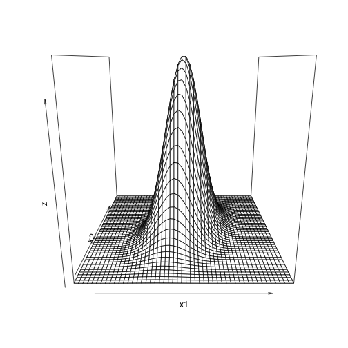

티스토리 블로거 [R프렌드님의 포스팅](http://rfriend.tistory.com/233)을 토대로 다변량 정규분포에 대해서 살펴보겠다.고등학교때 배운 정규분포는 1개의 변수를 가진다. 트럼프가 선거에서 이길확률과 같이, 단일변수를 가지고 정규분포를 그리며, 모수를 추정한다. 하지만, 때로는 여러가지의 변수를 가지고 확률을 추론 및 분석해야 할 수가 있다.이때 쓰이는 것이 다변량 정규분포이다. 다변량 정규분포에서는 확률 변수 X는 세부 확률변수 $X_1 \dots X_n$을 갖고 이 확률변수는 각각이 하나의 확률분포를 갖는다.

$$
X=[X_1,X_2,\dots X_t]\\
X_1 \sim N(\mu_{X1},\sigma^{X_1}),X_2=\dots
$$

예를 들어보자, 전력가격을 예측하기 위해서는 유가와 발전비중이 중요하다. 유가와 발전비중이 세부 확률변수$X_1$,$X_2$가 될수 있다. 유가와 발전비중은 고정된 변수가 아닌 가각의 확률변수이다. 다변량 확률분포에서는 평균은 벡터로, 공분산은 행렬로 표현된다.

$$
E(X)=\begin{bmatrix} E(X_{t}) \\ \vdots \\E(X_{t-s}) \end{bmatrix} =\begin{bmatrix} \mu_{t} \\ \vdots \\\mu_{t-s}\end{bmatrix}=\mu \\
Cov(Y)=\Sigma =E(Y-\mu)(Y-\mu)\\
=E\begin{bmatrix}\begin{pmatrix} Y_{t}-\mu_t \\ \vdots \\Y_{t-s}-\mu_{t-s}\end{pmatrix} \begin{pmatrix}Y_{t}-\mu_t, \dots,Y_{t-s}-\mu_{t-s}\end{pmatrix} \end{bmatrix}
$$

다변량 정규분포의 정규분포 확률분포식은 아래와 같다. (당연히 증명을 할 줄을 모른다;;) 여기서 $\Sigma$는 공분산행렬을 의미한다.

$$
f(x)=\frac{1}{\sqrt{(2\pi)^{n/2}|\boldsymbol\Sigma|^{1/2}}}
\exp\left(-\frac{1}{2}({x}-{\mu})^T{\boldsymbol\Sigma}^{-1}({x}-{\mu})
\right)
$$

## 2변량 변수 정규분포 그리기
을 토대로 다변량 정규분포를 한번 그려보겠다. 우리가 직관적으로 볼 수있는 함수는 3차원이므로, 세부확률변수가 2개이고, 표준정규분포를 따른다고 가정을 하겠다.

