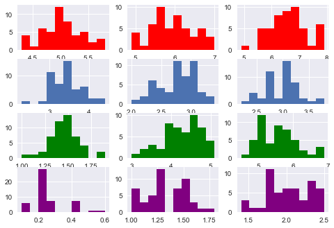

널리 알려진 데이터인 Iris를 활용해서 베이즈 추론을 해볼 것이다. Iris 데이터는 꽃잎과 꽃받침의 길이/넓이를 통해서 개화되는 꽃의 종류(setosa,versicolor,virginica)를 예측한다. 우선 Train Set에서 다음과 같은 결과 값이 나왔다고 가정해보자.

|             | setosa | versicolor|virginica |
| :------ :   |:------:| :------:  | :------: |
| Sample 결과   | 2      |      3     |      5    |

베이즈 정리를 통해서 $X_n $사건이후 setosa꽃이 필 조건부 확률 P($setosa\mid x_n$)는 아래과 같은 수식으로 표현될 수 있다. 여기서 P(setosa)는 쉽게 구할 수 있다. 2/(2+3+5)=0.2이다.


$$P(Seotsa \mid x_n )=\frac{P(setosa)P( x_n \mid setosa)}{P(setosa)P( x_n \mid setosa)+P(versicolor)P( x_n \mid versicolor)+P(virginica)P( x_n \mid virginica) } $$


그렇다면 $P(x_n \mid setosa)$는 어떻게 구할까? setosa,versicolor,virginica 마다 각각의 확률분포를 가진다. Naive Bayes에서는 이 확률 분포에 대해서 정의를 먼저 해야한다. 본 글에서는 각 데이터를 정규분포로 가정해서 베이즈 주의 추론을 해보겠다.


|             | setosa        | versicolor|virginica |
| :-------- : |:-----------:  | :-----:   | :-----:  |
| Sepal.Length|$ N(\mu,\sigma)$|          |          |
| Sepal.Width |               |           |          |
| Petal.Length|               |           |          |
| Petal.Width |             |           |          |


```python
from sklearn.datasets import load_iris
iris = load_iris()
df= pd.DataFrame(iris.data, columns=['sepal_length','sepal_width','petal_length','petal_width'])
df_output= pd.Series(iris.target,dtype="category")
df_output= df_output.cat.rename_categories(iris.target_names)
df['species']=df_output

import seaborn as sns
import matplotlib.pyplot as plt
fig = plt.figure();
ax1 = fig.add_subplot(4, 3, 1);ax1.hist(df[df['species']=='setosa']['sepal_length'],color='red')
ax2 = fig.add_subplot(4, 3, 2);ax2.hist(df[df['species']=='versicolor']['sepal_length'],color='red')
ax3 = fig.add_subplot(4, 3, 3);ax3.hist(df[df['species']=='virginica']['sepal_length'],color='red')

ax4 = fig.add_subplot(4, 3, 4);ax4.hist(df[df['species']=='setosa']['sepal_width'])
ax5 = fig.add_subplot(4, 3, 5);ax5.hist(df[df['species']=='versicolor']['sepal_width'])
ax6 = fig.add_subplot(4, 3, 6);ax6.hist(df[df['species']=='virginica']['sepal_width'])

ax7 = fig.add_subplot(4, 3, 7);ax7.hist(df[df['species']=='setosa']['petal_length'],color='green')
ax8 = fig.add_subplot(4, 3, 8);ax8.hist(df[df['species']=='versicolor']['petal_length'],color='green')
ax9 = fig.add_subplot(4, 3, 9);ax9.hist(df[df['species']=='virginica']['petal_length'],color='green')

ax10 = fig.add_subplot(4, 3, 10);ax10.hist(df[df['species']=='setosa']['petal_width'],color='purple')
ax11 = fig.add_subplot(4, 3, 11);ax11.hist(df[df['species']=='versicolor']['petal_width'],color='purple')
ax12 = fig.add_subplot(4, 3, 12);ax12.hist(df[df['species']=='virginica']['petal_width'],color='purple')

plt.show()
```





먼저, 해당 분포정규분포를 이루기에는 충분하지는 않지만, 연습이니 만큼 정규분포를 가정하고 추론을 진행하겠다. 본 Iris에서는 $ P(Sepal.Length \mid setosa) \cdots $ 등 총 12개의 조건부 확률 기반한 정규분포를 가진다. 각각이 정규분포의 평균과 분산을 가진다. 만약에서 새로운 사건 $x_n$ 에서 값이 (1,2,3,4)가 나았다고 가정 해보자. 조건부 확률은 아래과 같이 표시될 수 있다.  


* $P(Sepal.Length=1\mid Setosa) = P(\frac{1-\mu_{setosa}}{\sigma_{setosa}})$
* $P(Sepal.Width=2\mid Setosa) = P(\frac{2-\mu_{setosa}}{\sigma_{setosa}})$
* $P(Petal.Length=3\mid Setosa) = P(\frac{3-\mu_{setosa}}{\sigma_{setosa}})$
* $P(Petal.Width=4\mid Setosa) = P(\frac{4-\mu_{setosa}}{\sigma_{setosa}})$

사건 $x_n$이 일어났을때, 그것이 Setosa일 조건부확률은 아래와 같고,versicolor,virginica일 경우도 이와 비슷하게 예측을 하면 된다.


$$P( x_n \mid setosa)=P(Setosa)P(Sepal.Length=1\mid Setosa)+ \\ P(Setosa)P(Sepal.Width=2\mid Setosa)+\\ \\ P(Setosa)P(Petal.Length=3\mid Setosa)+ \\ P(Setosa)P(Petal.Width=4\mid Setosa)$$


이런 방식으로 $P(setosa\mid x_n)$,$P(versicolor\mid x_n)$,$P(virginica \mid x_n)$의 확률을 구할 수 있고 가장 높은 조건부 확률로 $x_n$를 분류하면 된다.  


```python
from sklearn.model_selection import train_test_split
X=df[['sepal_length','sepal_width','petal_length','petal_width']]
y=df['species']
X_train, X_test, y_train, y_test = train_test_split(X,y,test_size=0.25, random_state=42)
from sklearn.naive_bayes import GaussianNB
gnb = GaussianNB()
y_pred = gnb.fit(X_train, y_train).predict(X_test)
compare=pd.DataFrame({"예측":y_pred,"실제":y_test})
{'예측값과 실제값의 일치':sum(compare['실제']==compare['예측']),'예측값과 실제값의 불일치':sum(compare['실제'] != compare['예측'])}
```


    {'예측값과 실제값의 불일치': 0, '예측값과 실제값의 일치': 38}


Naive Bayes 분류를 통해서, 모든 셀에서 예측을 성공했다. 사실 이번 예측은 운이 좋은 예측이고 보다 좋은 예측을 위해서는 확률분포를 보다 엄밀하게 정의할 필요가 있다.
