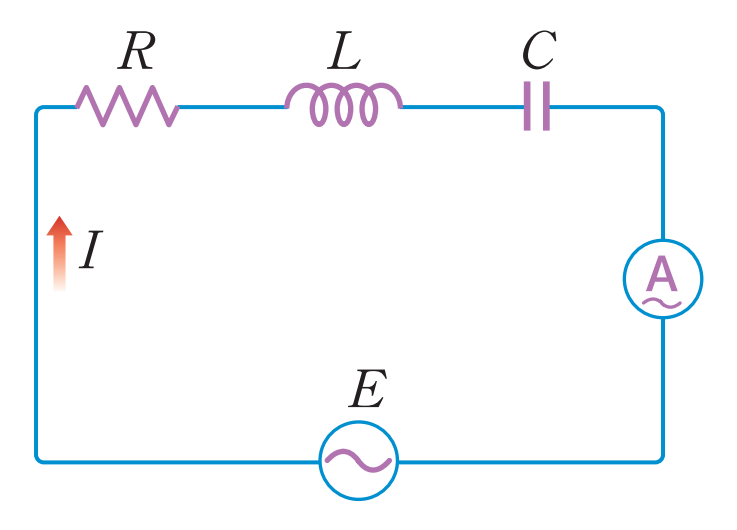
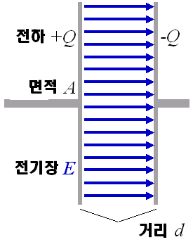

교류회로에서 기본은 RLC회로이다. RLC회로는 저항(R,Resistance)와 인덕턴스(L, Inductance),케파시턴스(C,Capacitance)로 구성된 회로다.

3개 모두 직류의 관점에서 볼때는 '저항요소'라고 할수 있는데, 여기에 걸리는 전압의 위상이 제작각 이기 때문에, R,L,C의 조합에 따라 최종 임피던스(Impedence)를 구해야 한다. 저항이란 것은 잘 알지만, 인덕턴스와 캐퍼시턴스에 대해서 알아보자.

인덕턴스와 캐퍼시턴스는 전류와 전압에 변화에 따른 일종의 저항이다. 직류던 교류던 모든 회로에서 존재하지만, 전압과 전류가 주기적으로 바뀌는 교류에서 훨씬 중요하다. 인덕턴스와 캐퍼시턴스를 의도적으로 증폭시켜주는 장치를 각각 인덕터(Inductor)와 캐파시터(Capacitor)라고 한다.  

# 인덕턴스(Inductance)
회로 전류가 변화할때, 그 변화를 막으려고하는 성질을 의미한다. 인덕턴스는 전류가 증가할 때, 전류의 증가를 막는다. 또한 전류가 감소할 때 전류의 감소를 막는다.

하나의 회로에서 흐르는 전류는 언제나 자계를 발생시킨다. 자계의 크기는 전류에서 의해서 결정된다. 회로의 전류가 증가, 감소하면 자계의 세기도 감소한다. 이런 자계의 수축 팽창 자체 유도 기전력이 나타나는데, 이것이 인덕턴스의 원리다.

인덕턴스의 약자는 L이고 단위는 핸리(Henry, 기호는 H)다. 전선이 코일형태로 꼬아져 있으면 자계의 크기가 증가해서 유도기전력이 증가하고 인덕턴스도 증가한다. 코일이 대표적인 인덕터(Inductor)이다. 많은 권선을 가진 코일일 수록 높은 인덕턴스를 지닌다.

# 캐파시턴스(Capacitance)
회로의 전압이 변화하면 그 회로는 이 변화를 막으려고 반항하는데,이 반항을 캐파시턴스라고 한다.

캐파시턴스 단위 패럿(F)이다.다만, 보통계산할때는 마이크로 패럿($\mu F$)을 많이 쓴다. 캐파시턴스를 의도적으로 증가시키는 장치를 캐파시터(Capacitor)라고 한다. 캐파시터는 여러종류가 있지만 보통 양쪽에 극판이 있고, 극판에 따라서 +,-전하가 충전이 된다.

참고로 아래와 같은 캐파시터가 직류회로에 설치되어 있으면 떨어져있어서 전류가 흐르지 않지만, 교류회로에서는 극성을 바꿀 때마다 캐파시터가 연속적으로 충방전되기 때문에 전류가 흐른다.

# 저항(Resistance), 인피던스(Impedance), 어드미턴스(Admittance)

직류에서 전기의 흐름을 방해하는 요소를 저항이라고 알고 있다. 교류회로에서는 RLC의 직렬/병렬 여부에 따라서 저항값을 임피던스와 어드미턴스로 정의한다.

RLC의 조합에 따라 교류회로에서는 L,C에서 허수저항이라고 할수 있는 리엑턴스(Reactance)가 생긴다. 이로 인해 위상차(Phase Difference)생겨서 별도의 정의를 하는데, 이에 관련해서는 다른 글에서 알아보겠다.
