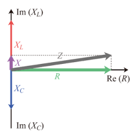
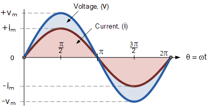
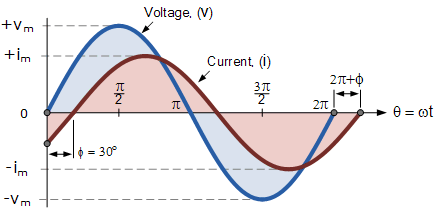

RLC 회로는 교류회로의 가장 기본이 되는 회로다. 교류회로에서의 차이점은 L(인덕턴스),C(컨덴서)에 따라서 저항에 일종의 '복소수 저항'이 추가된다는 점이다. 이 저항을 임피던스(impedance)라고 한다.   

교류에서는 전류의 흐름을 방해하는 물리량은 임피던스다. 그러므로, 교류에서 옴의 법칙은 아래와 같다.

V(전압)=I(전류) * Z(임피던스)

임피던스는 저항, 유도 리액턴스,용량 리액턴스로 구분된다.구체적으로 아래의 수식과 같이 정의된다.

$Z_{L}=R_{L}+ j\omega L(유도 리액턴스)- \frac{1}{j \omega C}(용량 리액턴스)$

# 위상차(Phase Difference)

임피던스에 대한 자세한 설명은 별도로 하겠다. 교류회로에서 저항대신 추가로 리액턴스가 발생하고, 이것의 총합을 임피던스라하는 이유는 주파수(Frequency)와 위상(Phase)때문이다.   

[앞선 글](https://youngji-cho.github.io/tech/2018/09/13/RLC%ED%9A%8C%EB%A1%9C%EC%9D%98-%EA%B5%AC%EC%84%B1%EC%9A%94%EC%86%8C.html)에서 설명했듯이, L,C는 유도기전력을 발생하고 이는 저항과 다른 방향의 벡터값을 가진다. 가로축이 실수값을 가진 저항이라면, 세로축이 복소수를 가진 리엑턴스라고 할수 있다.

전력(W)는 전압(V)와 전류(I)의 곱이다. 첫번째 교류회로는 L,C없고 R만 있으며, 이를 동상(same phase)라고 한다. 여기서는 전력(W)는 전압(V)과 전류(I)의 곱으로 나타낸다.   

두 번째 교류회로는 L,C가 포함된 회로다. 여기서는 유도기 전류 때문에, 전류와 전압의 위상이 차이가 난다. 여기서는 전력(W)은 단순 전압(V)과 전류(I)의 곱으로 나타내면 안된다.

# 피상전력, 유효전력, 역률
RLC교류회로에서 위상차가 나타냈을때, 전력은 피상전력과 유효전력으로 나뉜다.

- 피상전력(Apparent Power): 위상차를 고려하지 않은 전체전력을 의미. 여기서 위상차를 고려해서 차감된 유효전력(Active Power)과 무효전력(Reactive Power)으로 나뉜다.

**P=VI[VA]**

- 유효전력(Active Power): 위상차를 고려해서 무효전력을 차감한 전력이다.

**P=VI*cos$\theta$ [Watt]**

- 무효전력(Reactive Power): 위상차를 고려해서 차감되는 전력을 의한다.

**P=VI*sin$\theta$ [Var]**

피상전력은 아래의 식으로 계산된다.

피상전력=$\sqrt{(유효전력)^2+(무효전력)^2}$

=$\sqrt{(VI*cos \theta)^2+(VI*sin \theta)^2}$

=$\sqrt{(VI)^2((cos \theta)^2+(sin\theta)^2)+2(cos\theta+sin \theta)}$

= VI

전기실무에서 많이 보는 역률(Power Factor)는 $\frac{유효전력}{피상전력}$이다. 역률은 교류전력의 품질을 측정하는 지표중 하나다. 한국전력기준으로 통상적으로 90%이상의 역률을 요구한다.
